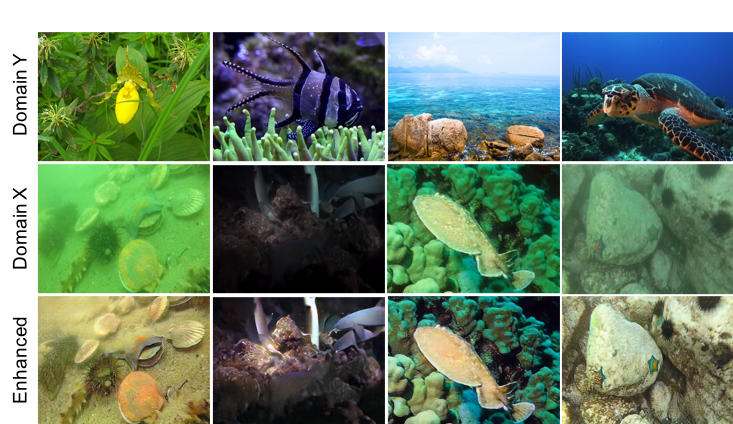
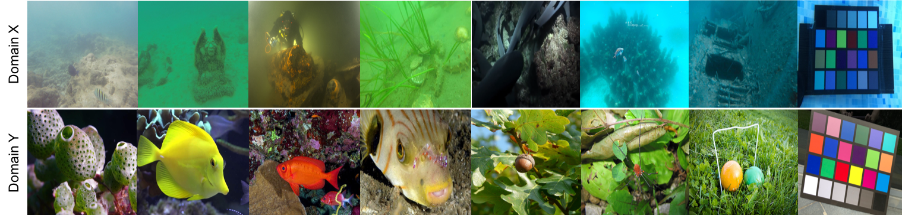

# WSUIE: Weakly Supervised Underwater Image Enhancement for Improved Visual Perception (RA-L 2021) [Paper](https://ieeexplore.ieee.org/document/9516935) 
Source code and dataset for our paper “WSUIE: Weakly Supervised Underwater Image Enhancement for Improved Visual Perception” by Hong, Lin and Wang, Xin and Xiao, Zhenlong and Zhang, Gan and Liu, Jun
Created by Lin Hong, email: 20B953023@stu.hit.edu.cn



## Requirement
1. Python 3.8.
1. Pytorch 1.4.0


### Our source code will released soon. !!!!

## UUIE dataset
UUIE dataset (https://ieeexplore.ieee.org/document/9516935) contains 4088 raw underwater images and 5629 high-quality images, and there are 50 raw underwater images and 50 high-quality images for the model test. As far as we know, the UUIE is the first public dataset dedicated to the research of weakly supervised underwater image enhancement. It is free for academic research, not for any commercial purposes.

Its folder looks like this:
````
   UUIE
   |-- training set
   |   |-- train A
   |   |-- train B
   |-- test set
   |   |-- test A
   |   |-- test B
````
Samples in UUIE dataset



### Citation

Please cite our papers if you use this dataset, code or any of the models. 

```
@ARTICLE{9516935,
  author={Hong, Lin and Wang, Xin and Xiao, Zhenlong and Zhang, Gan and Liu, Jun},
  journal={IEEE Robotics and Automation Letters}, 
  title={WSUIE: Weakly Supervised Underwater Image Enhancement for Improved Visual Perception}, 
  year={2021},
  volume={6},
  number={4},
  pages={8237-8244},
  doi={10.1109/LRA.2021.3105144}}
```